# VANI - Detailed System Architecture and ML Pipeline Guide

## Document Purpose

This document is a deep technical guide for the VANI project architecture.

It is intentionally separate from the main project README and focuses on:
- overall app architecture (Flutter client + backend)
- detailed ML inference pipeline architecture
- communication contracts and runtime flows
- project structure explanation
- reliability, performance, security, and deployment notes

## Downloadable Diagram Images

All diagrams in this document are also exported as image files for direct download and report usage.

1. System Overview
- SVG: [docs/architecture/diagrams/svg/01-system-overview.svg](docs/architecture/diagrams/svg/01-system-overview.svg)
- PNG: [docs/architecture/diagrams/png/01-system-overview.png](docs/architecture/diagrams/png/01-system-overview.png)


2. Frontend Layered View
- SVG: [docs/architecture/diagrams/svg/02-frontend-layered-view.svg](docs/architecture/diagrams/svg/02-frontend-layered-view.svg)
- PNG: [docs/architecture/diagrams/png/02-frontend-layered-view.png](docs/architecture/diagrams/png/02-frontend-layered-view.png)


3. Frontend Runtime Sequence
- SVG: [docs/architecture/diagrams/svg/03-frontend-runtime-sequence.svg](docs/architecture/diagrams/svg/03-frontend-runtime-sequence.svg)
- PNG: [docs/architecture/diagrams/png/03-frontend-runtime-sequence.png](docs/architecture/diagrams/png/03-frontend-runtime-sequence.png)

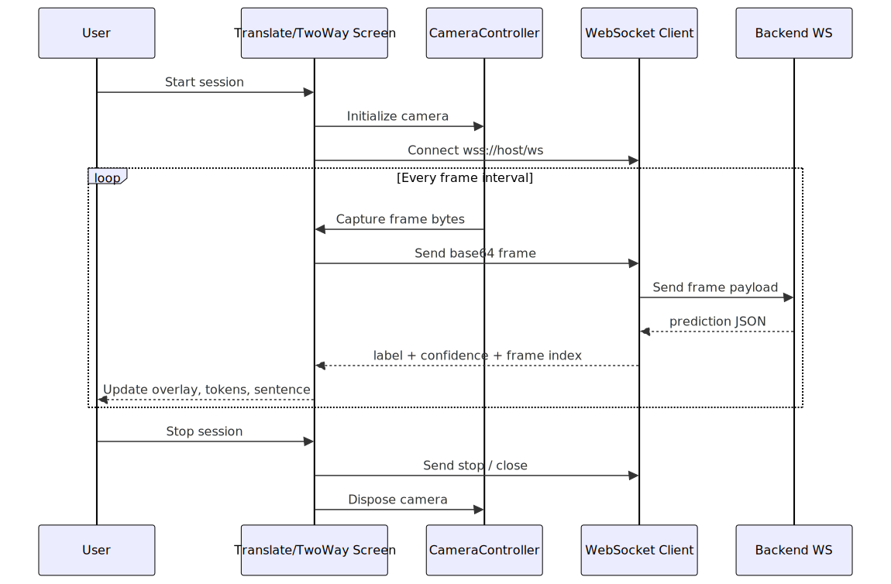

4. Backend Startup Pipeline
- SVG: [docs/architecture/diagrams/svg/04-backend-startup-pipeline.svg](docs/architecture/diagrams/svg/04-backend-startup-pipeline.svg)
- PNG: [docs/architecture/diagrams/png/04-backend-startup-pipeline.png](docs/architecture/diagrams/png/04-backend-startup-pipeline.png)


5. Backend Request Processing
- SVG: [docs/architecture/diagrams/svg/05-backend-request-processing.svg](docs/architecture/diagrams/svg/05-backend-request-processing.svg)
- PNG: [docs/architecture/diagrams/png/05-backend-request-processing.png](docs/architecture/diagrams/png/05-backend-request-processing.png)


6. ML Pipeline (Horizontal)
- SVG: [docs/architecture/diagrams/svg/06-ml-end-to-end-horizontal.svg](docs/architecture/diagrams/svg/06-ml-end-to-end-horizontal.svg)
- PNG: [docs/architecture/diagrams/png/06-ml-end-to-end-horizontal.png](docs/architecture/diagrams/png/06-ml-end-to-end-horizontal.png)


7. ML Pipeline (Vertical Report Format)
- SVG: [docs/architecture/diagrams/svg/07-ml-pipeline-vertical-report.svg](docs/architecture/diagrams/svg/07-ml-pipeline-vertical-report.svg)
- PNG: [docs/architecture/diagrams/png/07-ml-pipeline-vertical-report.png](docs/architecture/diagrams/png/07-ml-pipeline-vertical-report.png)


8. Agile Model Cycle Diagram
- SVG: [docs/architecture/diagrams/svg/08-agile-model-cycle.svg](docs/architecture/diagrams/svg/08-agile-model-cycle.svg)
- PNG: [docs/architecture/diagrams/png/08-agile-model-cycle.png](docs/architecture/diagrams/png/08-agile-model-cycle.png)


9. Complete Use Case Diagram
- SVG: [docs/architecture/diagrams/svg/09-use-case-diagram.svg](docs/architecture/diagrams/svg/09-use-case-diagram.svg)
- PNG: [docs/architecture/diagrams/png/09-use-case-diagram.png](docs/architecture/diagrams/png/09-use-case-diagram.png)


10. Feasibility Study Diagram
- SVG: [docs/architecture/diagrams/svg/10-feasibility-study.svg](docs/architecture/diagrams/svg/10-feasibility-study.svg)
- PNG: [docs/architecture/diagrams/png/10-feasibility-study.png](docs/architecture/diagrams/png/10-feasibility-study.png)


### Generating PNG Versions from SVG

All diagrams above are provided in SVG format for scalability and clarity. To generate high-quality PNG versions:

**Option 1: Online Conversion Tool**
- Visit [CloudConvert](https://cloudconvert.com/svg-to-png) or [Convertio](https://convertio.co/svg-png/)
- Upload the SVG file and download as PNG

**Option 2: Python (Recommended)**
```bash
pip install cairosvg
python -c "import cairosvg; cairosvg.svg2png(url='docs/architecture/diagrams/svg/09-use-case-diagram.svg', write_to='docs/architecture/diagrams/png/09-use-case-diagram.png', dpi=300)"
```

**Option 3: Command Line Tools**
- ImageMagick: `convert input.svg output.png`
- Inkscape: `inkscape input.svg --export-filename output.png`

## 9. Complete Use Case Diagram Explained

The VANI system's complete use case diagram (Diagram 9) illustrates all major functional capabilities and actor interactions across the platform. This section provides a detailed breakdown of all use cases, relationships, and their implementations.

## 10. Feasibility Study Analysis

A comprehensive feasibility analysis demonstrates that the VANI system is fully viable across multiple dimensions:

### 10.1 Operational Feasibility

**Ease of Operation**
- Simple gesture recognition makes sign input intuitive
- Interface designed for minimal learning curve
- Users require no technical knowledge
- Real-time feedback loop drives engagement

**Communication Effectiveness**
- Enables meaningful interaction between hearing and deaf individuals
- Supports sentence-level translation for context-aware output
- Reduces dependency on professional interpreters
- Improves accessibility in educational and healthcare settings

**Emergency Support**
- Quick SOS alert generation (shake or tap)
- Automatic GPS location attachment
- SMS dispatch to pre-configured contacts
- Critical safety feature for vulnerable users

**Accessibility & Usability**
- Multi-language support (English, Hindi, Marathi)
- Designed for diverse user groups and abilities
- Tested and ready for real-world environments (hospitals, schools, public services)
- Accessible design patterns throughout

### 10.2 Technical Feasibility

**Hardware Requirements**
- Runs on standard mobile devices (Android, iOS)
- Only camera capability required (already built-in)
- Low computational overhead on client
- Backend compute handled by Railway infrastructure

**Software & Framework**
- Flutter proven cross-platform framework
- YOLO inference engine available and trainable
- WebSocket for real-time bidirectional communication
- All required libraries production-ready

**Infrastructure**
- Railway deployment operational and tested
- Supabase authentication backend available
- Google Drive model hosting for automatic downloads
- Scalable architecture for growth

### 10.3 Economic Feasibility

**Cost Analysis**
- Cloud infrastructure costs moderate (Railway + Supabase)
- Open-source tools reduce licensing costs
- Low maintenance overhead post-deployment
- One-time development cost amortized over user base

**Return on Investment**
- Improved accessibility reaches underserved populations
- Emergency response value immeasurable for user safety
- Educational utility supports learning and independence
- Market potential in healthcare, education, public services

**Scalability Potential**
- Horizontal scaling via Railway auto-scaling
- Multi-region deployment ready
- API-first architecture supports integrations
- Model updates don't require app releases

### 10.4 Legal & Compliance Feasibility

**Privacy & Data Protection**
- Local Hive storage for offline-first operation
- Optional cloud sync only when authenticated
- No unnecessary data collection
- User control over contact information

**Authentication & Authorization**
- Supabase authentication provides secure access
- Secure WebSocket (wss://) for production
- Contact encryption ready for implementation
- Session management built-in

**Compliance**
- Accessibility standards compliant (WCAG principles)
- Regional language requirements met (EN/HI/MR)
- Emergency protocol compatible with national standards
- Privacy-by-design architecture

### 10.5 Risk Mitigation

Key risks and mitigation strategies:

| Risk | Impact | Mitigation |
|------|--------|------------|
| ML model accuracy | Low-confidence predictions reduce user trust | Continuous model retraining, confidence thresholds, manual correction workflow |
| Network latency | Delayed predictions degrade UX | Frame throttling, local smoothing, offline fallback mode |
| User adoption | Low uptake limits impact | Accessibility-first design, multi-language support, emergency feature value prop |
| Data privacy concerns | Regulatory/user trust issues | Local-first storage, optional cloud, transparent sync policy |
| Backend availability | Service disruption | Railway health checks, error recovery, graceful degradation |

**Conclusion**: VANI demonstrates strong feasibility across all dimensions. The system is operationally sound, technically proven, economically viable, and legally compliant. Implementation can proceed with confidence.

### Actors (5 Primary)

1. **Deaf/Hard-of-Hearing (DHH) User** — Primary user, primary consumer of all sign translation and communication features
2. **Hearing Person** — Secondary user facilitating two-way communication with DHH users
3. **Emergency Contact** — External stakeholder receiving emergency SOS alerts via SMS
4. **ML Backend/YOLO** — System component executing real-time machine learning inference on camera frames
5. **External Services** — Cloud services (Supabase authentication, SMS gateway, GPS location services)

### Use Case Categories (40 Total Use Cases)

#### **1. Sign Translation (4 Use Cases)**
Core functionality for converting Indian Sign Language (ISL) to text in real-time.

- **Translate ISL to Text** — Main use case: captures camera frames and recognizes hand signs, converting them to text labels
  - Includes: Camera frame capture, WebSocket transmission, YOLO inference, prediction return
  - Extended by: Real-time confidence display, TTS output
  - Actor: DHH User

- **Build Sentence Output** — Constructs grammatically coherent sentences from recognized signs using SentenceBuilder (25-model vocabulary)
  - Extends: Translate ISL to Text
  - Relationship: Uses AutoAddEngine with stability detection and cooldown timers
  - Actor: DHH User

- **Adjust Predictions** — Allows users to manually correct or refine misrecognized signs
  - Extends: Build Sentence Output
  - Actor: DHH User

- **View Real-time Confidence** — Displays prediction confidence scores (percentage) for each recognized sign
  - Extends: Translate ISL to Text
  - Actor: DHH User

#### **2. Two-Way Communication (4 Use Cases)**
Bidirectional communication between DHH and hearing users.

- **Initiate Two-Way Chat** — Starts a two-way communication session
  - Includes: ISL-to-text translation, Text-to-ISL translation
  - Actors: DHH User, Hearing Person

- **Translate Text to ISL Signs** — Converts hearing user's text to ISL sign recommendations
  - Includes: Sign dictionary lookup, ISL sign suggestions
  - Actor: Hearing Person

- **Translate ISL Signs to Text** — Converts DHH user's hand signs to text for hearing user
  - Includes: Translate ISL to Text use case
  - Relationship: Part of Two-Way Chat flow
  - Actor: DHH User

- **Exchange Messages** — Bidirectional flow of translated messages between users
  - Includes: TTS for text-to-speech of hearing user's messages
  - Actors: Both DHH and Hearing Users

#### **3. ISL Learning & Reference (4 Use Cases)**
Educational features for learning Indian Sign Language.

- **View Sign Dictionary** — Comprehensive ISL sign reference library (Alphabet, Numbers, Words categories)
  - Includes: Filter by category, Search functionality
  - Actor: DHH User

- **Filter by Category** — Segmented view of signs (Alphabet/Numbers/Words) with count badges
  - Includes: Flip card display, Search within category
  - Actor: DHH User

- **Flip Card to View Details** — Interactive card-flip mechanism showing sign video/image and definition
  - Includes: Category filter, detailed information display
  - Actor: DHH User

- **Search Signs** — Full-text search across ISL sign library
  - Includes: Category filtering
  - Actor: DHH User

#### **4. AI Assistant (4 Use Cases)**
Powered by Gemini 2.0 Flash API for intelligent ISL learning support.

- **Chat with ISL Assistant** — Conversational interface for learning about ISL and accessibility
  - Includes: Speech input, AI suggestion generation
  - Extended by: Language switching, TTS output
  - Actor: DHH User

- **Use Speech Input** — Voice-to-text input for assistant queries
  - Includes: Speech recognition, Speech-to-Text API
  - Actor: DHH User

- **Receive AI Suggestions** — Get contextual recommendations from Gemini API for ISL learning
  - Extends: Chat with ISL Assistant
  - Relationship: Fetches from Gemini 2.0 Flash API
  - Actor: DHH User

- **View ISL Sign Suggestions** — Displays recommended signs from AI, linked to dictionary
  - Includes: Sign dictionary lookup
  - Extends: Receive AI Suggestions
  - Actor: DHH User

#### **5. Emergency Management (8 Use Cases)**
Comprehensive emergency response system with local offline storage and cloud synchronization.

- **Manage Emergency Contacts** — CRUD operations for emergency contact management
  - Includes: Add/Edit contact, Delete contact, Local storage via Hive
  - Relationship: Syncs to Supabase, Extends: Supabase authentication
  - Actor: DHH User

- **Add/Edit Contact** — Create or modify emergency contact entry (name, phone, relation)
  - Includes: Form validation, Relation color-coding
  - Actor: DHH User

- **Delete Contact** — Remove contact from emergency list with confirmation dialog
  - Includes: Confirmation dialog, Local database update
  - Actor: DHH User

- **Setup Emergency Scenario** — Configure emergency response for specific situations (Medical, Police, Fire, etc.)
  - Extends: Manage Emergency Contacts
  - Relationship: Defines who to contact for each scenario
  - Actor: DHH User

- **Trigger SOS** — Send emergency alert (shake-activated or button-triggered)
  - Includes: Location inclusion, SMS alert sending
  - Relationship: Requires authentication, Uses configured contacts
  - Actor: DHH User

- **Include Location in SOS** — Embeds GPS coordinates in emergency alert
  - Includes: GPS service query, Permission handling
  - Extends: Trigger SOS
  - Relationship: Conditional on location permission
  - Actor: DHH User

- **Send SMS Alert** — Dispatch SMS notification to emergency contacts
  - Includes: SMS gateway integration via url_launcher
  - Includes: Contact selection based on scenario
  - Extends: Trigger SOS
  - Actor: System → Emergency Contact (receives)

- **View Helpline Numbers** — Reference list of national helpline numbers (Police, Medical, Fire, etc.)
  - Localized in: English, Hindi, Marathi
  - Actor: DHH User

#### **6. Accessibility & Settings (9 Use Cases)**
User preferences and information about the platform.

- **Switch Language** — Change UI language (English, Hindi, Marathi)
  - Extends: Chat with ISL Assistant, View Sign Dictionary, Two-Way Communication
  - Relationship: Uses Flutter localization (l10n)
  - Actor: DHH User

- **Toggle Dark/Light Theme** — Theme customization for visual accessibility
  - Relationship: Global theme state in root app
  - Actor: DHH User

- **Enable Text-to-Speech** — Audio output for all text (translations, messages, suggestions)
  - Extends: Translate ISL to Text, Two-Way Chat, Chat with ISL Assistant
  - Relationship: Uses flutter_tts package
  - Actor: DHH User

- **Enable Haptic Feedback** — Vibration feedback on interactions (mobile-only, safe no-op on web)
  - Extends: Trigger SOS, Manage Emergency Contacts
  - Relationship: Uses vibration package
  - Actor: DHH User

- **View Accessibility Info** — Information about platform accessibility features
  - Actor: DHH User

- **View Bridging Gaps Info** → Information about how VANI bridges communication gaps
  - Actor: DHH User

- **View Inclusivity Info** → Documentation on inclusivity principles
  - Actor: DHH User

- **View Privacy Policy** → Data protection and privacy documentation
  - Actor: DHH User

- **View Education Resources** → Educational materials about ISL and accessibility
  - Actor: DHH User

#### **7. System Operations (7 Use Cases)**
Backend infrastructure and real-time ML pipeline operations.

- **Capture Camera Frames** — Device camera input at regular intervals (100ms default)
  - Includes: Permission handling, Frame encoding to base64
  - Relationship: Core to real-time sign recognition
  - Actor: System (triggered by use cases 1, 5, 7)

- **Send Frame to Backend** — WebSocket transmission of encoded frames to ML backend
  - Includes: Base64 encoding, WebSocket channel management
  - Extends: Capture Camera Frames
  - Relationship: Uses wss:// for production to Railway
  - Actor: System

- **Process with YOLO** — ML inference execution on backend
  - Includes: Frame decoding, YOLO model processing, Prediction smoothing
  - Extends: Send Frame to Backend
  - Relationship: Executed on Railway backend, Uses isl_best.pt model
  - Actor: ML Backend/YOLO

- **Return Predictions** — Send inference results (label + confidence) back to client
  - Includes: JSON prediction payload, WebSocket response
  - Extends: Process with YOLO
  - Relationship: Critical path for real-time UX
  - Actor: ML Backend → Flutter Client

- **Authenticate User** — Supabase authentication for secure access
  - Includes: Cloud contact synchronization eligibility
  - Relationship: Optional, enables cloud features
  - Actor: External Services (Supabase)

- **Sync Contacts to Cloud** — Backup emergency contacts to Supabase
  - Includes: Cloud storage, Offline fallback to Hive
  - Extends: Authenticate User
  - Relationship: Enables cross-device emergency contact access
  - Actor: Supabase Service

- **Access Offline Contacts** — Retrieve emergency contacts from local Hive database
  - Relationship: Fallback when offline, No internet required
  - Includes: Local storage query
  - Actor: System

### Key Relationships & Patterns

**Include Relationships (Mandatory Flows)**
- Translation flows always include camera capture, frame transmission, and inference
- Two-way communication includes bidirectional translation
- Emergency triggering includes contact selection and alert dispatch
- Authentication includes cloud synchronization

**Extend Relationships (Optional Enhancements)**
- Accessibility features (TTS, haptic, language) extend core use cases
- Real-time confidence display extends translation
- AI suggestions extend chat and learning
- Location embedding is optional for SOS

**Actor Interactions**
- DHH User is primary actor across all major use cases
- Hearing Person limited to two-way communication
- Emergency Contact passively receives alerts
- ML Backend and External Services are system actors

### Implementation References

**File Locations:**
- Translation: [lib/screens/TranslateScreen.dart](lib/screens/TranslateScreen.dart)
- Two-Way: [lib/screens/TwoWayScreen.dart](lib/screens/TwoWayScreen.dart)
- Learning: [lib/screens/Signspage.dart](lib/screens/Signspage.dart)
- Assistant: [lib/screens/Islassistantscreen.dart](lib/screens/Islassistantscreen.dart)
- Emergency: [lib/screens/EmergencyScreen.dart](lib/screens/EmergencyScreen.dart), [lib/screens/EmergencySetupScreen.dart](lib/screens/EmergencySetupScreen.dart)
- Services: [lib/services](lib/services) (EmergencyService, LocationService, SupabaseService)
- Backend: [isl_backend/app.py](isl_backend/app.py) — FastAPI WebSocket endpoint

## 1. System At A Glance

VANI is a cross-platform accessibility system for Indian Sign Language (ISL) support.

High-level architecture:
- Frontend: Flutter app (Android, iOS, Web, Desktop targets)
- Backend: FastAPI service with YOLO inference over WebSocket
- Data transport: base64 camera frames from app to backend, prediction JSON from backend to app
- Auxiliary backend: Supabase for auth + emergency contact synchronization
- Local persistence: Hive for emergency contacts and offline continuity

### High-Level Component Diagram

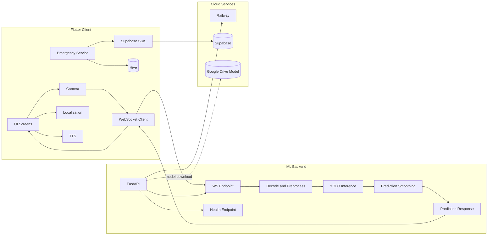

## 2. Frontend Architecture (Flutter)

## 2.1 Core Entry And Bootstrap

Primary app bootstrap:
- [lib/main.dart](lib/main.dart)

Main responsibilities:
- initialize app-level dependencies (Hive, adapters, Supabase)
- configure system UI style
- provide theme and locale state
- route into authentication gate and root shell

Key architectural patterns:
- singleton services for shared infrastructure (EmergencyService, SupabaseService)
- stateful root app for global theme/locale
- responsive rendering paths (mobile-first and web/tablet layouts)

## 2.2 UI Layer Organization

Main screens are under:
- [lib/screens](lib/screens)

Important screen modules:
- [lib/screens/HomeScreen.dart](lib/screens/HomeScreen.dart)
- [lib/screens/TranslateScreen.dart](lib/screens/TranslateScreen.dart)
- [lib/screens/TwoWayScreen.dart](lib/screens/TwoWayScreen.dart)
- [lib/screens/Signspage.dart](lib/screens/Signspage.dart)
- [lib/screens/Islassistantscreen.dart](lib/screens/Islassistantscreen.dart)
- [lib/screens/EmergencyScreen.dart](lib/screens/EmergencyScreen.dart)
- [lib/screens/EmergencySetupScreen.dart](lib/screens/EmergencySetupScreen.dart)

Shared UI components:
- [lib/components/GlobalNavbar.dart](lib/components/GlobalNavbar.dart)
- [lib/components/AuthDialog.dart](lib/components/AuthDialog.dart)
- [lib/components/SOSFloatingButton.dart](lib/components/SOSFloatingButton.dart)

### Frontend Layered View

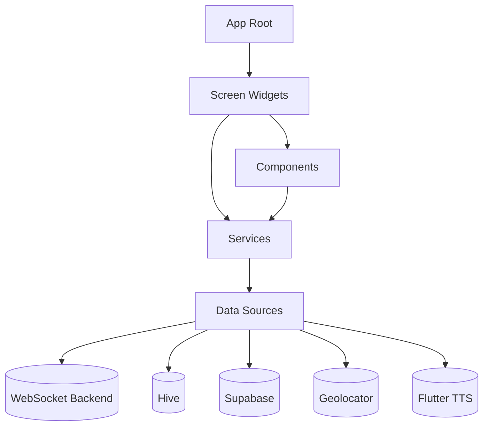

## 2.3 Feature-Oriented Frontend Modules

### A) Real-Time Translation (Terminal)

Primary file:
- [lib/screens/TranslateScreen.dart](lib/screens/TranslateScreen.dart)

Responsibilities:
- camera acquisition and lifecycle handling
- periodic frame capture
- WebSocket connection management to backend
- prediction parsing, confidence handling, stability logic
- sentence/token builder flow and transcript composition
- regional text translation fallback via HTTP translation endpoint
- TTS playback

Notable operational details:
- production host and path are configured with constants in this screen
- reconnect logic and session states are managed in-widget
- frame cadence is controlled by interval timers

### B) Two-Way Communication Bridge

Primary file:
- [lib/screens/TwoWayScreen.dart](lib/screens/TwoWayScreen.dart)

Responsibilities:
- two-sided communication UX for deaf/hearing flow
- real-time sign detection stream path
- camera controls, pending sign confirmation, and message send actions
- reconnect and socket status lifecycle

Design relation to Translate screen:
- same backend transport pattern
- adapted UI/interaction model for conversational bridge context

### C) Emergency Module

Core files:
- [lib/screens/EmergencyScreen.dart](lib/screens/EmergencyScreen.dart)
- [lib/screens/EmergencySetupScreen.dart](lib/screens/EmergencySetupScreen.dart)
- [lib/services/EmergencyService.dart](lib/services/EmergencyService.dart)
- [lib/services/LocationService.dart](lib/services/LocationService.dart)
- [lib/models/EmergencyContact.dart](lib/models/EmergencyContact.dart)

Responsibilities:
- maintain emergency contacts (max constraints and validation)
- send SOS actions with message templates
- resolve GPS location with graceful fallback
- synchronize contacts between local Hive and Supabase when authenticated
- provide mobile affordances (shake trigger, haptics, direct deep links)

### D) Authentication And Profile Sync

Primary integration points:
- [lib/components/AuthDialog.dart](lib/components/AuthDialog.dart)
- [lib/services/SupabaseService.dart](lib/services/SupabaseService.dart)

Responsibilities:
- user sign-up / sign-in
- profile upsert
- emergency contact sync pull/push strategy

### E) Localization And Internationalization

Primary localization file:
- [lib/l10n/AppLocalizations.dart](lib/l10n/AppLocalizations.dart)

Current architecture:
- in-code localization map for supported languages
- key-based lookup via AppLocalizations.of(context).t(key)
- English fallback strategy if target locale key is unavailable

## 2.4 Frontend Runtime Flow (Prediction Path)

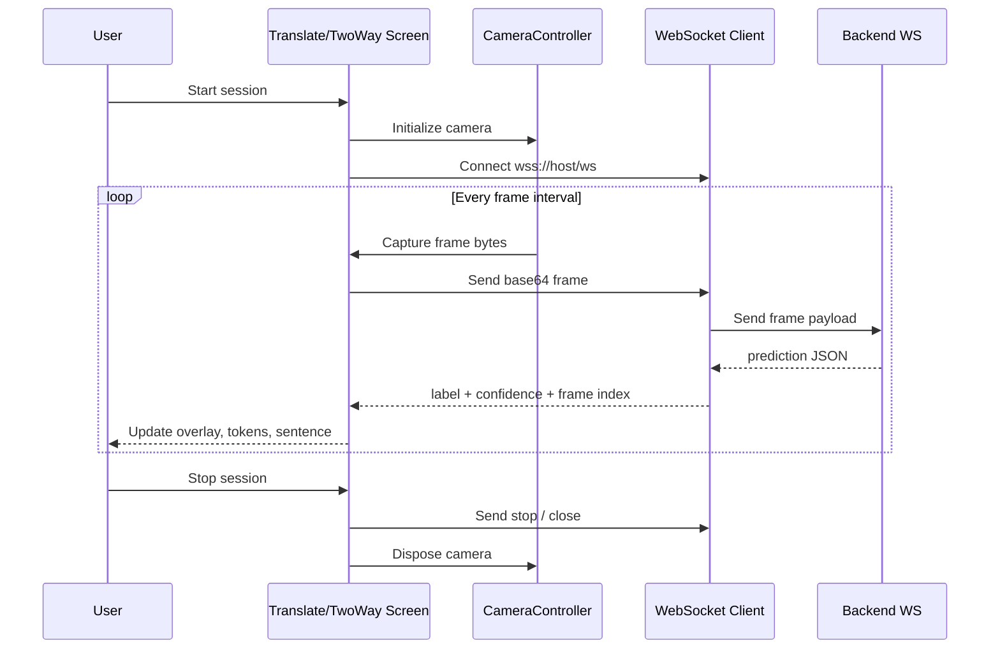

## 3. Backend Architecture (FastAPI + YOLO)

Backend root:
- [isl_backend/app.py](isl_backend/app.py)

Deployment files:
- [isl_backend/Dockerfile](isl_backend/Dockerfile)
- [isl_backend/requirements.txt](isl_backend/requirements.txt)
- [isl_backend/railway.json](isl_backend/railway.json)

## 3.1 Startup Pipeline

On startup, backend:
1. prepares model directory
2. validates local model artifact
3. downloads model from Google Drive when absent/corrupt
4. loads YOLO model into CPU runtime
5. exposes health and websocket endpoints

### Startup Diagram

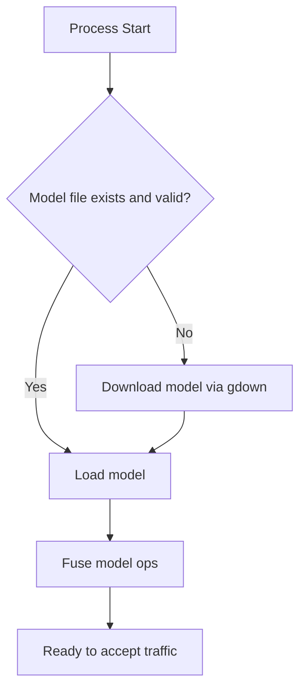

## 3.2 WebSocket Inference Architecture

The `/ws` endpoint handles:
- socket accept and client lifecycle
- protocol control messages (`__PING__`, `__STOP__`)
- frame decode from base64 to OpenCV image
- inference dispatch in executor to keep event loop responsive
- top detection extraction + confidence
- temporal smoothing of predictions
- JSON prediction response

### Backend Request Processing Diagram

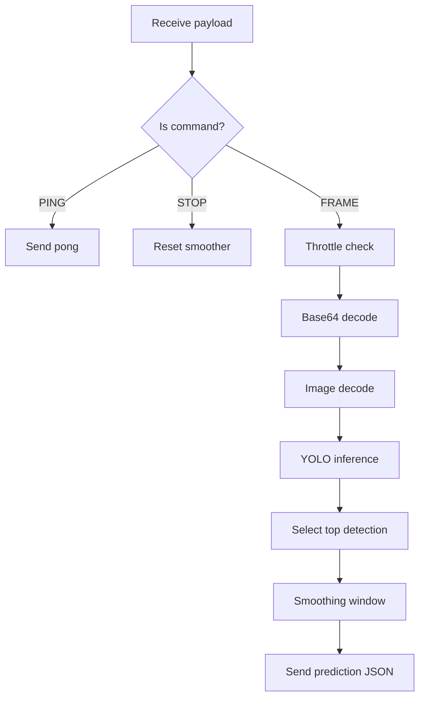

## 3.3 Backend Endpoints

### GET /health

Purpose:
- liveliness and model-load status checks

Typical response shape:

```json
{
  "status": "online",
  "model_loaded": true,
  "engine": "YOLOv11-CPU"
}
```

### WS /ws

Input payloads:
- base64 frame strings (with or without data URI header)
- control commands: `__PING__`, `__STOP__`

Output payloads:

```json
{
  "type": "prediction",
  "label": "<sign>",
  "confidence": 0.87,
  "frame": 123
}
```

Error payload pattern includes:
- type: error
- message: reason text

## 4. Detailed ML Pipeline Architecture

This section explains the full inference path from sensor to rendered text.

## 4.1 End-To-End ML Pipeline


### 4.1.1 Vertical ML Pipeline (Report Format)

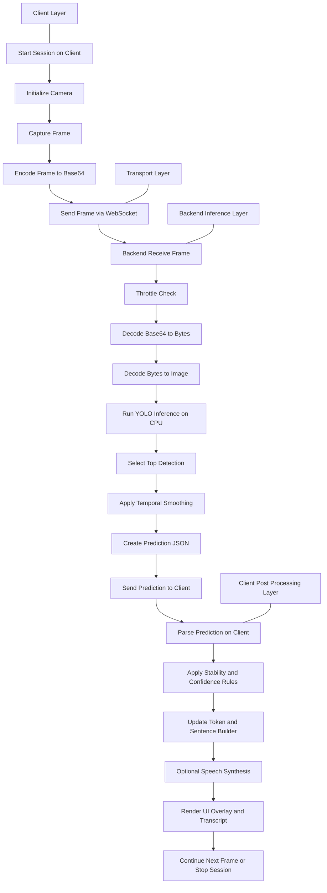

## 4.2 Pipeline Stage Breakdown

### Stage 1: Capture

- camera is initialized using Flutter camera plugin
- frames are sampled periodically (not full continuous stream)
- capture rate is bounded by timer interval on client

### Stage 2: Serialization And Transport

- image bytes are converted to base64 text
- transport uses WebSocket for low-latency bidirectional communication
- secure transport in production via wss

### Stage 3: Decode And Validate

- server strips optional data URI prefix
- base64 decoded to bytes
- bytes converted to OpenCV matrix (`cv2.imdecode`)

### Stage 4: Inference

- YOLO model performs object/sign detection on CPU
- confidence threshold and max detection count enforce output quality constraints
- inference run in executor to avoid blocking async event loop

### Stage 5: Temporal Smoothing

- rolling window stores recent labels/confidence pairs
- dominant label in window selected
- confidence averaged for selected dominant class
- this reduces visible flicker and accidental transient predictions

### Stage 6: Client Post-Processing

- prediction fed into UI state machine
- confidence/stability used for builder UX and overlays
- user can manually commit/remove tokens
- translated/regional representation and TTS are applied as needed

## 4.3 Latency And Throughput Considerations

Key controls visible in code:
- frontend frame interval constant controls send frequency
- backend frame skip constant controls infer cadence
- max detection = 1 simplifies result handling and improves speed
- smoothing window improves UX confidence at slight temporal lag

Trade-offs:
- lower interval -> faster updates but more CPU/network load
- higher threshold -> fewer false positives but more misses
- larger smoothing window -> steadier labels but slower adaptation

## 4.4 Agile Model Cycle Diagram

This diagram maps the actual iterative delivery flow used by this project across product, Flutter, backend, and ML tracks.

Download links:
- SVG: [docs/architecture/diagrams/svg/08-agile-model-cycle.svg](docs/architecture/diagrams/svg/08-agile-model-cycle.svg)
- PNG: [docs/architecture/diagrams/png/08-agile-model-cycle.png](docs/architecture/diagrams/png/08-agile-model-cycle.png)

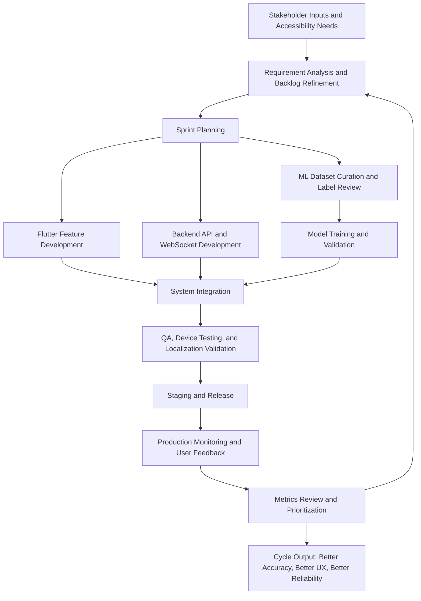

## 4.5 Complete Use Case Diagram

This comprehensive use case diagram illustrates all major functional capabilities, actors, and their interactions across the entire VANI platform. It follows the UML standard use case notation with actors on the sides, system boundary, and include/extend relationships.

Download links:
- SVG: [docs/architecture/diagrams/svg/09-use-case-diagram.svg](docs/architecture/diagrams/svg/09-use-case-diagram.svg)
- PNG: [docs/architecture/diagrams/png/09-use-case-diagram.png](docs/architecture/diagrams/png/09-use-case-diagram.png)

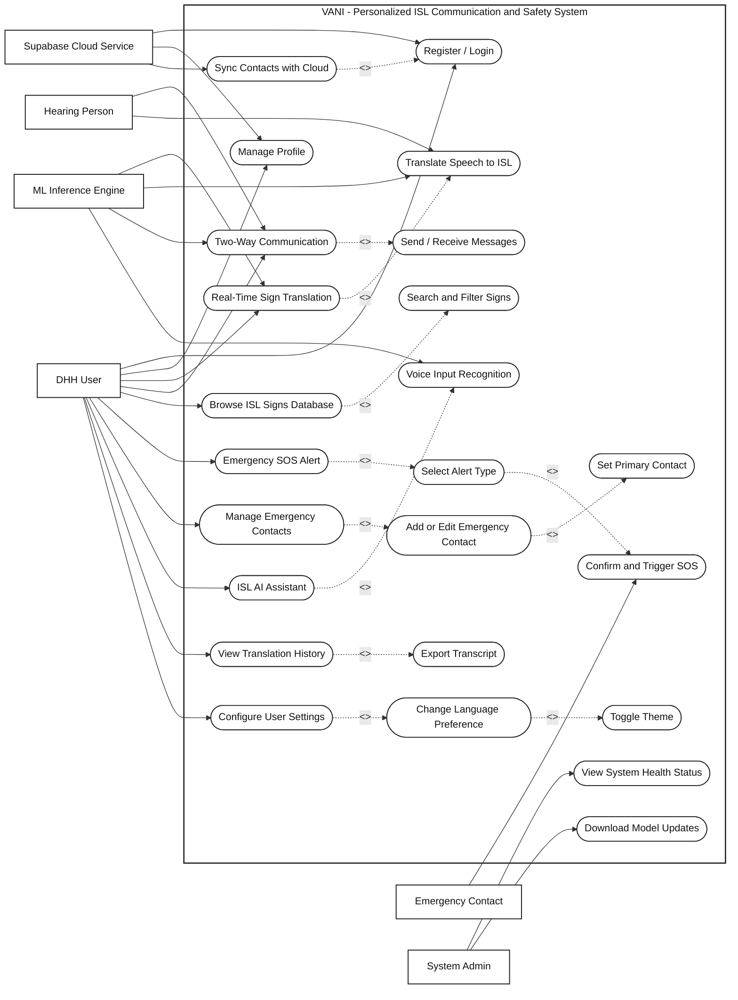

### Use Case Summary

**6 Primary Actors:**
1. **Deaf/Hard-of-Hearing (DHH) User** — Primary user; interacts with all translation, communication, learning, emergency, and settings features
2. **Hearing Person** — Secondary user; participates in two-way translation and communication scenarios
3. **Emergency Contact** — Passive stakeholder; receives emergency SOS alerts via SMS/WhatsApp
4. **System Administrator** — Monitors system health and manages ML model updates
5. **ML Inference Engine** — Backend YOLO service; provides real-time sign detection and speech-to-sign translation
6. **Supabase Cloud** — Cloud backend; handles authentication, profile storage, and contact synchronization

**24 Key Use Cases Organized into 5 Categories:**

**A. Authentication & Profile Management (3 UC)**
- Register/Login → triggers cloud sync on first login
- Manage Profile → updates user information in Supabase
- Sync Contacts with Cloud → extends login flow; syncs Hive contacts to Supabase

**B. Real-Time Translation (4 UC)**
- Real-Time Sign Translation → captures camera, sends frames to ML engine, receives predictions
- Translate Speech to ISL → parallel use case where hearing person speaks and system translates to ISL
- These include bidirectional frame capture and inference invocation

**C. Two-Way Communication Bridge (2 UC)**
- Two-Way Communication → allows DHH and hearing users to communicate with real-time translation
- Send/Receive Messages → includes message history, confirmation, and delivery tracking

**D. ISL Reference Repository (2 UC)**
- Browse ISL Signs Database → explore vocabulary with video/GIF demonstrations
- Search and Filter Signs → keyword/category-based lookup in sign inventory

**E. Emergency Management (4 UC)**
- Emergency SOS Alert → main use case for triggering distress signals
- Select Alert Type → choose from General Help, Medical, Police, Fire, Accident, Child Safety
- Confirm and Trigger SOS → confirmation step before sending alerts to emergency contacts
- Manage Emergency Contacts → add, edit, set primary contact for SOS dispatch

**F. AI Assistant (2 UC)**
- ISL AI Assistant → conversational AI powered by speech recognition and ISL generation
- Voice Input Recognition → speech-to-text preprocessing before AI processing

**G. User Settings & Reporting (4 UC)**
- View Translation History → transcript repository of past sessions
- Export Transcript → download/share translation records
- Configure User Settings → global preferences
- Change Language Preference (English/Hindi/Marathi) → UI localization choice
- Toggle Dark/Light Mode → theme selection

**H. System Administration (1 UC)**
- View System Health Status → health endpoint, model status, uptime metrics
- Download Model Updates → refresh YOLO model to latest version

### Relationships & Flow Patterns

**Include (Mandatory Dependencies):**
- Real-Time Sign Translation **includes** Translate Speech to ISL (both invoke same backend)
- Emergency SOS **includes** Select Alert Type and Confirm Trigger (workflow steps)
- Manage Emergency Contacts **includes** Add/Edit and Set Primary (sub-operations)
- Browse ISL Signs **includes** Search and Filter (search is mandatory)
- Configure Settings **includes** Language and Theme toggles (child operations)

**Extend (Conditional/Optional Enhancements):**
- Register/Login **extends** Sync Contacts (optional on first auth only)

**Actor Relationships:**
- DHH User initiates most features (primary actor on 10 use cases)
- Hearing Person only participates in symmetric two-way paths
- Emergency Contact is notified asynchronously (dashed dependency)
- ML Engine and Cloud are internal system actors (dashed usage lines)

## 5. Project Structure Deep Dive

Root-level explanation:

```text
vani/
  lib/                         Flutter app source
    components/                Reusable UI blocks
    l10n/                      Localization maps/delegate
    models/                    Domain entities + adapters
    screens/                   Feature screens
    services/                  Integrations and business services
    utils/                     Platform helpers and utility code
    main.dart                  App bootstrap and root shell

  isl_backend/                 FastAPI + YOLO inference service
    app.py                     API and websocket inference loop
    requirements.txt           Python dependency lock-ish file
    Dockerfile                 Container build recipe
    railway.json               Railway deployment hints
    model/                     Model artifact directory

  android/ ios/ web/ windows/ linux/ macos/
                               Platform runners generated by Flutter

  assets/fonts/                Google Sans font files used by app theme
  pubspec.yaml                 Flutter dependencies, assets, fonts
  README.md                    Existing general project README
  README_ARCHITECTURE.md       This document
```

## 6. Data And State Architecture

## 6.1 Local State

Storage engine:
- Hive box `emergency_contacts`

Entity:
- EmergencyContact fields include identity, relation, primary marker, and optional Supabase row id

Benefits:
- offline-first emergency workflow
- fast local reads
- explicit sync boundaries with cloud

## 6.2 Remote State (Supabase)

Used for:
- authentication/session
- user profile updates
- emergency contacts persistence and sync

Sync model:
- after login/signup, app can pull contacts from Supabase to local Hive
- local contacts without remote IDs can be pushed to Supabase

## 6.3 Real-Time Stream State

Managed in translation screens:
- socket connectivity state
- camera readiness and lifecycle state
- session state machine (idle/connecting/running/stopping/error)
- current label, confidence, and builder token collections

## 7. Architecture For Internationalization

Localization strategy:
- all user-facing strings accessed through key lookups
- supported locales include English, Hindi, Marathi
- fallback to English if locale value is missing
- localization delegate configured globally in MaterialApp

Impact on architecture:
- feature modules are language-agnostic at logic level
- text surfaces remain centrally maintainable via localization map

## 8. Deployment Architecture

## 8.1 Backend Deployment (Railway)

Deployment model:
- Dockerfile-based build
- single replica by default in railway config
- restart-on-failure policy

Runtime details:
- process binds to env-driven `PORT`
- health endpoint can be used by platform checks

## 8.2 Frontend Deployment

- mobile via Flutter Android/iOS build pipeline
- web via Flutter web build and static hosting
- runtime ML endpoint currently configured in app constants for Translate and TwoWay screens

## 8.3 Environment/Config Notes

Current project pattern includes constants for:
- websocket host/path in translation screens
- optional backend-enable flags in service/screen modules
- Supabase values supplied via dart-define for app bootstrap

## 9. Reliability, Failure Modes, And Recovery

## 9.1 Client-Side Failure Cases

- camera unavailable or permission denied
- websocket unreachable
- transient disconnect during session
- translation/TTS API failures
- location acquisition timeout

Recovery patterns in code:
- session transitions to explicit error state
- reconnect attempts with max retry limits
- graceful fallback messages and controllable restart path

## 9.2 Backend Failure Cases

- model download failure
- model load incompatibility
- malformed frame payloads
- inference exceptions per-frame

Recovery patterns:
- startup logs and model availability checks
- health endpoint reflects model_loaded
- frame processing errors are isolated and loop continues

## 10. Security And Privacy Considerations

Current architecture notes:
- production socket uses secure wss transport
- CORS currently permissive in backend (`allow_origins=["*"]`)
- emergency data includes sensitive contact and location context

Hardening recommendations:
1. restrict CORS to known origins for production
2. add auth/token verification for websocket sessions
3. move host and feature toggles to environment-based config
4. define retention policy for logs and prediction metadata
5. implement rate limits and payload size checks on websocket input

## 11. Performance Tuning Playbook

Client tuning levers:
- frame interval constants
- camera resolution preset
- connection retry strategy
- UI update throttling

Backend tuning levers:
- FRAME_SKIP_MS
- confidence threshold
- max detections
- CPU thread/executor tuning
- model quantization/optimization in future iterations

Monitoring recommendations:
- websocket connection count
- median inference time
- dropped-frame ratio
- prediction confidence distribution
- reconnect frequency per client

## 12. Suggested Future Architecture Improvements

1. Centralized runtime config service
- unify endpoint and feature flags in one config layer

2. Dedicated domain layers in Flutter
- separate presentation, application, and infra logic for easier testing

3. Protocol versioning
- include protocol version in websocket handshake/payload

4. Observability improvements
- structured logs, tracing IDs, and dashboard metrics

5. Scalable inference topology
- queue/broker or inference worker pool for high concurrent load

6. Model lifecycle management
- explicit model version pinning and rollout strategy

## 13. Quick Reference: Key Files

App bootstrap and shell:
- [lib/main.dart](lib/main.dart)

Localization:
- [lib/l10n/AppLocalizations.dart](lib/l10n/AppLocalizations.dart)

Translation and bridge:
- [lib/screens/TranslateScreen.dart](lib/screens/TranslateScreen.dart)
- [lib/screens/TwoWayScreen.dart](lib/screens/TwoWayScreen.dart)

Emergency domain:
- [lib/screens/EmergencyScreen.dart](lib/screens/EmergencyScreen.dart)
- [lib/screens/EmergencySetupScreen.dart](lib/screens/EmergencySetupScreen.dart)
- [lib/services/EmergencyService.dart](lib/services/EmergencyService.dart)
- [lib/services/LocationService.dart](lib/services/LocationService.dart)
- [lib/services/SupabaseService.dart](lib/services/SupabaseService.dart)
- [lib/models/EmergencyContact.dart](lib/models/EmergencyContact.dart)

Backend:
- [isl_backend/app.py](isl_backend/app.py)
- [isl_backend/requirements.txt](isl_backend/requirements.txt)
- [isl_backend/Dockerfile](isl_backend/Dockerfile)
- [isl_backend/railway.json](isl_backend/railway.json)

## 14. End-To-End Architecture Summary

VANI uses a pragmatic hybrid architecture:
- Flutter handles cross-platform UI and device integrations
- FastAPI + YOLO provides real-time ISL inference over websocket
- Supabase and Hive combine cloud sync with local-first emergency reliability
- localization and responsive design support broad accessibility use-cases

The most critical production path is:
camera frame -> websocket transport -> YOLO inference -> smoothed prediction -> actionable UI feedback.

This path is already implemented and operational, with room for improved configurability, security hardening, and observability as the system scales.
