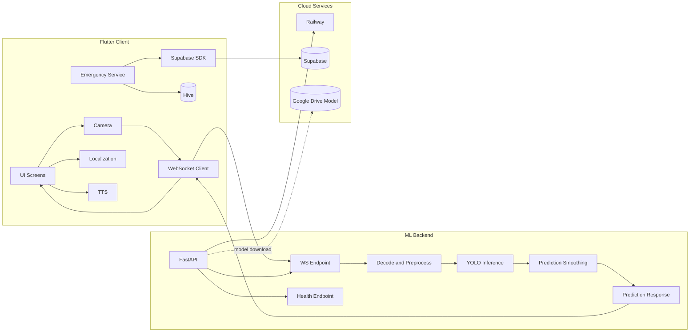
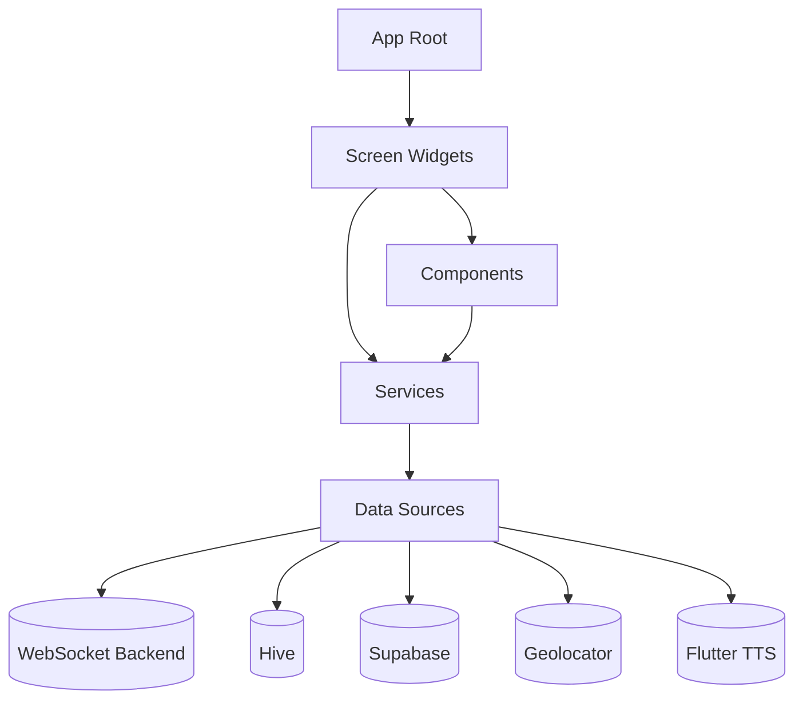
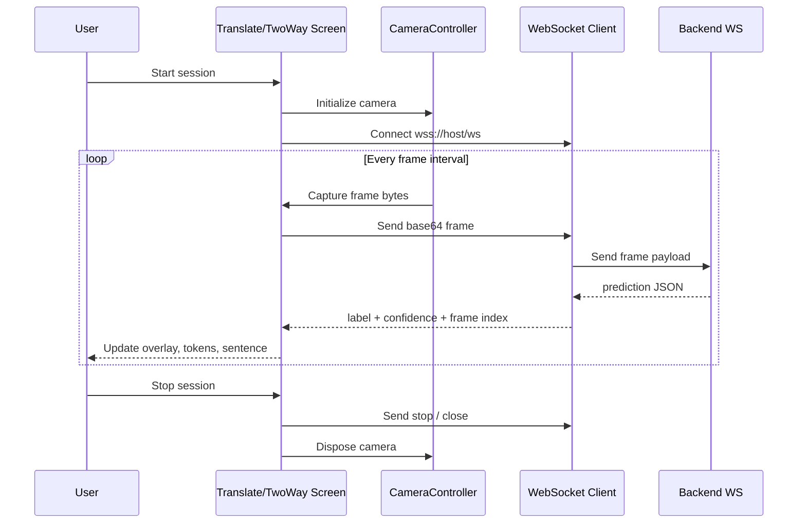
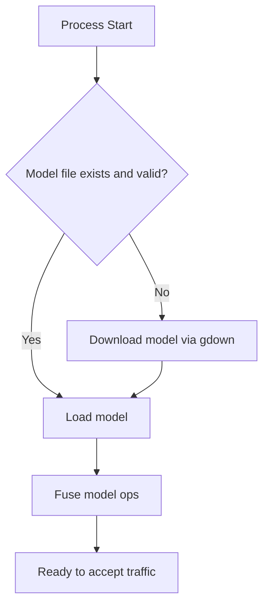
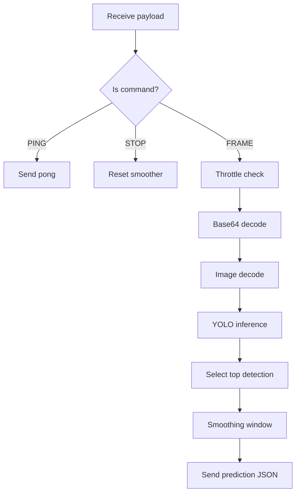
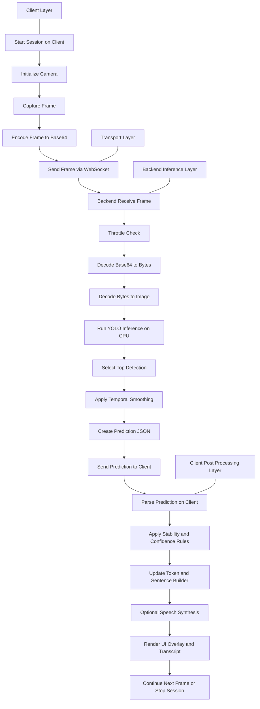

# VANI - Detailed System Architecture and ML Pipeline Guide

## Document Purpose

This document is a deep technical guide for the VANI project architecture.

It is intentionally separate from the main project README and focuses on:
- overall app architecture (Flutter client + backend)
- detailed ML inference pipeline architecture
- communication contracts and runtime flows
- project structure explanation
- reliability, performance, security, and deployment notes

## Downloadable Diagram Images

All diagrams in this document are also exported as image files for direct download and report usage.

1. System Overview
- SVG: [docs/architecture/diagrams/svg/01-system-overview.svg](docs/architecture/diagrams/svg/01-system-overview.svg)
- PNG: [docs/architecture/diagrams/png/01-system-overview.png](docs/architecture/diagrams/png/01-system-overview.png)


2. Frontend Layered View
- SVG: [docs/architecture/diagrams/svg/02-frontend-layered-view.svg](docs/architecture/diagrams/svg/02-frontend-layered-view.svg)
- PNG: [docs/architecture/diagrams/png/02-frontend-layered-view.png](docs/architecture/diagrams/png/02-frontend-layered-view.png)


3. Frontend Runtime Sequence
- SVG: [docs/architecture/diagrams/svg/03-frontend-runtime-sequence.svg](docs/architecture/diagrams/svg/03-frontend-runtime-sequence.svg)
- PNG: [docs/architecture/diagrams/png/03-frontend-runtime-sequence.png](docs/architecture/diagrams/png/03-frontend-runtime-sequence.png)


4. Backend Startup Pipeline
- SVG: [docs/architecture/diagrams/svg/04-backend-startup-pipeline.svg](docs/architecture/diagrams/svg/04-backend-startup-pipeline.svg)
- PNG: [docs/architecture/diagrams/png/04-backend-startup-pipeline.png](docs/architecture/diagrams/png/04-backend-startup-pipeline.png)


5. Backend Request Processing
- SVG: [docs/architecture/diagrams/svg/05-backend-request-processing.svg](docs/architecture/diagrams/svg/05-backend-request-processing.svg)
- PNG: [docs/architecture/diagrams/png/05-backend-request-processing.png](docs/architecture/diagrams/png/05-backend-request-processing.png)


6. ML Pipeline (Horizontal)
- SVG: [docs/architecture/diagrams/svg/06-ml-end-to-end-horizontal.svg](docs/architecture/diagrams/svg/06-ml-end-to-end-horizontal.svg)
- PNG: [docs/architecture/diagrams/png/06-ml-end-to-end-horizontal.png](docs/architecture/diagrams/png/06-ml-end-to-end-horizontal.png)


7. ML Pipeline (Vertical Report Format)
- SVG: [docs/architecture/diagrams/svg/07-ml-pipeline-vertical-report.svg](docs/architecture/diagrams/svg/07-ml-pipeline-vertical-report.svg)
- PNG: [docs/architecture/diagrams/png/07-ml-pipeline-vertical-report.png](docs/architecture/diagrams/png/07-ml-pipeline-vertical-report.png)


## 1. System At A Glance

VANI is a cross-platform accessibility system for Indian Sign Language (ISL) support.

High-level architecture:
- Frontend: Flutter app (Android, iOS, Web, Desktop targets)
- Backend: FastAPI service with YOLO inference over WebSocket
- Data transport: base64 camera frames from app to backend, prediction JSON from backend to app
- Auxiliary backend: Supabase for auth + emergency contact synchronization
- Local persistence: Hive for emergency contacts and offline continuity

### High-Level Component Diagram



## 2. Frontend Architecture (Flutter)

## 2.1 Core Entry And Bootstrap

Primary app bootstrap:
- [lib/main.dart](lib/main.dart)

Main responsibilities:
- initialize app-level dependencies (Hive, adapters, Supabase)
- configure system UI style
- provide theme and locale state
- route into authentication gate and root shell

Key architectural patterns:
- singleton services for shared infrastructure (EmergencyService, SupabaseService)
- stateful root app for global theme/locale
- responsive rendering paths (mobile-first and web/tablet layouts)

## 2.2 UI Layer Organization

Main screens are under:
- [lib/screens](lib/screens)

Important screen modules:
- [lib/screens/HomeScreen.dart](lib/screens/HomeScreen.dart)
- [lib/screens/TranslateScreen.dart](lib/screens/TranslateScreen.dart)
- [lib/screens/TwoWayScreen.dart](lib/screens/TwoWayScreen.dart)
- [lib/screens/Signspage.dart](lib/screens/Signspage.dart)
- [lib/screens/Islassistantscreen.dart](lib/screens/Islassistantscreen.dart)
- [lib/screens/EmergencyScreen.dart](lib/screens/EmergencyScreen.dart)
- [lib/screens/EmergencySetupScreen.dart](lib/screens/EmergencySetupScreen.dart)

Shared UI components:
- [lib/components/GlobalNavbar.dart](lib/components/GlobalNavbar.dart)
- [lib/components/AuthDialog.dart](lib/components/AuthDialog.dart)
- [lib/components/SOSFloatingButton.dart](lib/components/SOSFloatingButton.dart)

### Frontend Layered View



## 2.3 Feature-Oriented Frontend Modules

### A) Real-Time Translation (Terminal)

Primary file:
- [lib/screens/TranslateScreen.dart](lib/screens/TranslateScreen.dart)

Responsibilities:
- camera acquisition and lifecycle handling
- periodic frame capture
- WebSocket connection management to backend
- prediction parsing, confidence handling, stability logic
- sentence/token builder flow and transcript composition
- regional text translation fallback via HTTP translation endpoint
- TTS playback

Notable operational details:
- production host and path are configured with constants in this screen
- reconnect logic and session states are managed in-widget
- frame cadence is controlled by interval timers

### B) Two-Way Communication Bridge

Primary file:
- [lib/screens/TwoWayScreen.dart](lib/screens/TwoWayScreen.dart)

Responsibilities:
- two-sided communication UX for deaf/hearing flow
- real-time sign detection stream path
- camera controls, pending sign confirmation, and message send actions
- reconnect and socket status lifecycle

Design relation to Translate screen:
- same backend transport pattern
- adapted UI/interaction model for conversational bridge context

### C) Emergency Module

Core files:
- [lib/screens/EmergencyScreen.dart](lib/screens/EmergencyScreen.dart)
- [lib/screens/EmergencySetupScreen.dart](lib/screens/EmergencySetupScreen.dart)
- [lib/services/EmergencyService.dart](lib/services/EmergencyService.dart)
- [lib/services/LocationService.dart](lib/services/LocationService.dart)
- [lib/models/EmergencyContact.dart](lib/models/EmergencyContact.dart)

Responsibilities:
- maintain emergency contacts (max constraints and validation)
- send SOS actions with message templates
- resolve GPS location with graceful fallback
- synchronize contacts between local Hive and Supabase when authenticated
- provide mobile affordances (shake trigger, haptics, direct deep links)

### D) Authentication And Profile Sync

Primary integration points:
- [lib/components/AuthDialog.dart](lib/components/AuthDialog.dart)
- [lib/services/SupabaseService.dart](lib/services/SupabaseService.dart)

Responsibilities:
- user sign-up / sign-in
- profile upsert
- emergency contact sync pull/push strategy

### E) Localization And Internationalization

Primary localization file:
- [lib/l10n/AppLocalizations.dart](lib/l10n/AppLocalizations.dart)

Current architecture:
- in-code localization map for supported languages
- key-based lookup via AppLocalizations.of(context).t(key)
- English fallback strategy if target locale key is unavailable

## 2.4 Frontend Runtime Flow (Prediction Path)



## 3. Backend Architecture (FastAPI + YOLO)

Backend root:
- [isl_backend/app.py](isl_backend/app.py)

Deployment files:
- [isl_backend/Dockerfile](isl_backend/Dockerfile)
- [isl_backend/requirements.txt](isl_backend/requirements.txt)
- [isl_backend/railway.json](isl_backend/railway.json)

## 3.1 Startup Pipeline

On startup, backend:
1. prepares model directory
2. validates local model artifact
3. downloads model from Google Drive when absent/corrupt
4. loads YOLO model into CPU runtime
5. exposes health and websocket endpoints

### Startup Diagram



## 3.2 WebSocket Inference Architecture

The `/ws` endpoint handles:
- socket accept and client lifecycle
- protocol control messages (`__PING__`, `__STOP__`)
- frame decode from base64 to OpenCV image
- inference dispatch in executor to keep event loop responsive
- top detection extraction + confidence
- temporal smoothing of predictions
- JSON prediction response

### Backend Request Processing Diagram



## 3.3 Backend Endpoints

### GET /health

Purpose:
- liveliness and model-load status checks

Typical response shape:

```json
{
  "status": "online",
  "model_loaded": true,
  "engine": "YOLOv11-CPU"
}
```

### WS /ws

Input payloads:
- base64 frame strings (with or without data URI header)
- control commands: `__PING__`, `__STOP__`

Output payloads:

```json
{
  "type": "prediction",
  "label": "<sign>",
  "confidence": 0.87,
  "frame": 123
}
```

Error payload pattern includes:
- type: error
- message: reason text

## 4. Detailed ML Pipeline Architecture

This section explains the full inference path from sensor to rendered text.

## 4.1 End-To-End ML Pipeline


### 4.1.1 Vertical ML Pipeline (Report Format)



## 4.2 Pipeline Stage Breakdown

### Stage 1: Capture

- camera is initialized using Flutter camera plugin
- frames are sampled periodically (not full continuous stream)
- capture rate is bounded by timer interval on client

### Stage 2: Serialization And Transport

- image bytes are converted to base64 text
- transport uses WebSocket for low-latency bidirectional communication
- secure transport in production via wss

### Stage 3: Decode And Validate

- server strips optional data URI prefix
- base64 decoded to bytes
- bytes converted to OpenCV matrix (`cv2.imdecode`)

### Stage 4: Inference

- YOLO model performs object/sign detection on CPU
- confidence threshold and max detection count enforce output quality constraints
- inference run in executor to avoid blocking async event loop

### Stage 5: Temporal Smoothing

- rolling window stores recent labels/confidence pairs
- dominant label in window selected
- confidence averaged for selected dominant class
- this reduces visible flicker and accidental transient predictions

### Stage 6: Client Post-Processing

- prediction fed into UI state machine
- confidence/stability used for builder UX and overlays
- user can manually commit/remove tokens
- translated/regional representation and TTS are applied as needed

## 4.3 Latency And Throughput Considerations

Key controls visible in code:
- frontend frame interval constant controls send frequency
- backend frame skip constant controls infer cadence
- max detection = 1 simplifies result handling and improves speed
- smoothing window improves UX confidence at slight temporal lag

Trade-offs:
- lower interval -> faster updates but more CPU/network load
- higher threshold -> fewer false positives but more misses
- larger smoothing window -> steadier labels but slower adaptation

## 5. Project Structure Deep Dive

Root-level explanation:

```text
vani/
  lib/                         Flutter app source
    components/                Reusable UI blocks
    l10n/                      Localization maps/delegate
    models/                    Domain entities + adapters
    screens/                   Feature screens
    services/                  Integrations and business services
    utils/                     Platform helpers and utility code
    main.dart                  App bootstrap and root shell

  isl_backend/                 FastAPI + YOLO inference service
    app.py                     API and websocket inference loop
    requirements.txt           Python dependency lock-ish file
    Dockerfile                 Container build recipe
    railway.json               Railway deployment hints
    model/                     Model artifact directory

  android/ ios/ web/ windows/ linux/ macos/
                               Platform runners generated by Flutter

  assets/fonts/                Google Sans font files used by app theme
  pubspec.yaml                 Flutter dependencies, assets, fonts
  README.md                    Existing general project README
  README_ARCHITECTURE.md       This document
```

## 6. Data And State Architecture

## 6.1 Local State

Storage engine:
- Hive box `emergency_contacts`

Entity:
- EmergencyContact fields include identity, relation, primary marker, and optional Supabase row id

Benefits:
- offline-first emergency workflow
- fast local reads
- explicit sync boundaries with cloud

## 6.2 Remote State (Supabase)

Used for:
- authentication/session
- user profile updates
- emergency contacts persistence and sync

Sync model:
- after login/signup, app can pull contacts from Supabase to local Hive
- local contacts without remote IDs can be pushed to Supabase

## 6.3 Real-Time Stream State

Managed in translation screens:
- socket connectivity state
- camera readiness and lifecycle state
- session state machine (idle/connecting/running/stopping/error)
- current label, confidence, and builder token collections

## 7. Architecture For Internationalization

Localization strategy:
- all user-facing strings accessed through key lookups
- supported locales include English, Hindi, Marathi
- fallback to English if locale value is missing
- localization delegate configured globally in MaterialApp

Impact on architecture:
- feature modules are language-agnostic at logic level
- text surfaces remain centrally maintainable via localization map

## 8. Deployment Architecture

## 8.1 Backend Deployment (Railway)

Deployment model:
- Dockerfile-based build
- single replica by default in railway config
- restart-on-failure policy

Runtime details:
- process binds to env-driven `PORT`
- health endpoint can be used by platform checks

## 8.2 Frontend Deployment

- mobile via Flutter Android/iOS build pipeline
- web via Flutter web build and static hosting
- runtime ML endpoint currently configured in app constants for Translate and TwoWay screens

## 8.3 Environment/Config Notes

Current project pattern includes constants for:
- websocket host/path in translation screens
- optional backend-enable flags in service/screen modules
- Supabase values supplied via dart-define for app bootstrap

## 9. Reliability, Failure Modes, And Recovery

## 9.1 Client-Side Failure Cases

- camera unavailable or permission denied
- websocket unreachable
- transient disconnect during session
- translation/TTS API failures
- location acquisition timeout

Recovery patterns in code:
- session transitions to explicit error state
- reconnect attempts with max retry limits
- graceful fallback messages and controllable restart path

## 9.2 Backend Failure Cases

- model download failure
- model load incompatibility
- malformed frame payloads
- inference exceptions per-frame

Recovery patterns:
- startup logs and model availability checks
- health endpoint reflects model_loaded
- frame processing errors are isolated and loop continues

## 10. Security And Privacy Considerations

Current architecture notes:
- production socket uses secure wss transport
- CORS currently permissive in backend (`allow_origins=["*"]`)
- emergency data includes sensitive contact and location context

Hardening recommendations:
1. restrict CORS to known origins for production
2. add auth/token verification for websocket sessions
3. move host and feature toggles to environment-based config
4. define retention policy for logs and prediction metadata
5. implement rate limits and payload size checks on websocket input

## 11. Performance Tuning Playbook

Client tuning levers:
- frame interval constants
- camera resolution preset
- connection retry strategy
- UI update throttling

Backend tuning levers:
- FRAME_SKIP_MS
- confidence threshold
- max detections
- CPU thread/executor tuning
- model quantization/optimization in future iterations

Monitoring recommendations:
- websocket connection count
- median inference time
- dropped-frame ratio
- prediction confidence distribution
- reconnect frequency per client

## 12. Suggested Future Architecture Improvements

1. Centralized runtime config service
- unify endpoint and feature flags in one config layer

2. Dedicated domain layers in Flutter
- separate presentation, application, and infra logic for easier testing

3. Protocol versioning
- include protocol version in websocket handshake/payload

4. Observability improvements
- structured logs, tracing IDs, and dashboard metrics

5. Scalable inference topology
- queue/broker or inference worker pool for high concurrent load

6. Model lifecycle management
- explicit model version pinning and rollout strategy

## 13. Quick Reference: Key Files

App bootstrap and shell:
- [lib/main.dart](lib/main.dart)

Localization:
- [lib/l10n/AppLocalizations.dart](lib/l10n/AppLocalizations.dart)

Translation and bridge:
- [lib/screens/TranslateScreen.dart](lib/screens/TranslateScreen.dart)
- [lib/screens/TwoWayScreen.dart](lib/screens/TwoWayScreen.dart)

Emergency domain:
- [lib/screens/EmergencyScreen.dart](lib/screens/EmergencyScreen.dart)
- [lib/screens/EmergencySetupScreen.dart](lib/screens/EmergencySetupScreen.dart)
- [lib/services/EmergencyService.dart](lib/services/EmergencyService.dart)
- [lib/services/LocationService.dart](lib/services/LocationService.dart)
- [lib/services/SupabaseService.dart](lib/services/SupabaseService.dart)
- [lib/models/EmergencyContact.dart](lib/models/EmergencyContact.dart)

Backend:
- [isl_backend/app.py](isl_backend/app.py)
- [isl_backend/requirements.txt](isl_backend/requirements.txt)
- [isl_backend/Dockerfile](isl_backend/Dockerfile)
- [isl_backend/railway.json](isl_backend/railway.json)

## 14. End-To-End Architecture Summary

VANI uses a pragmatic hybrid architecture:
- Flutter handles cross-platform UI and device integrations
- FastAPI + YOLO provides real-time ISL inference over websocket
- Supabase and Hive combine cloud sync with local-first emergency reliability
- localization and responsive design support broad accessibility use-cases

The most critical production path is:
camera frame -> websocket transport -> YOLO inference -> smoothed prediction -> actionable UI feedback.

This path is already implemented and operational, with room for improved configurability, security hardening, and observability as the system scales.
