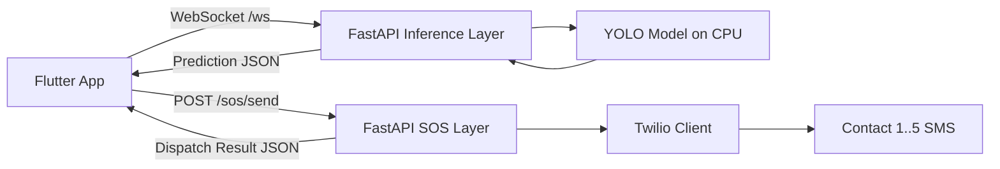
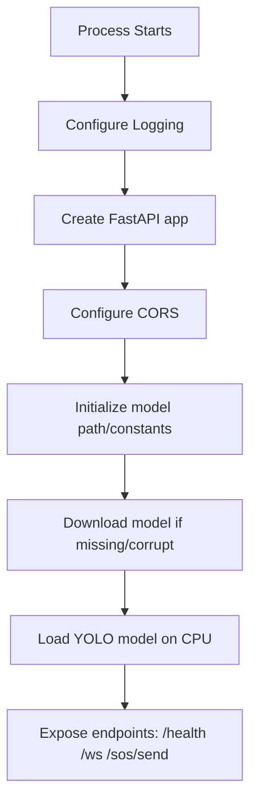
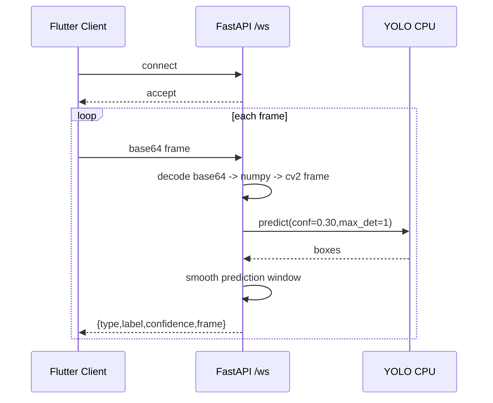
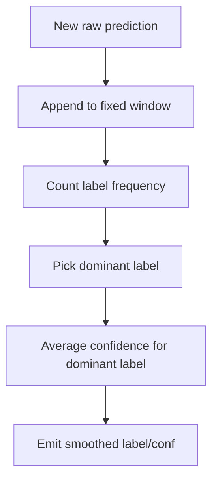
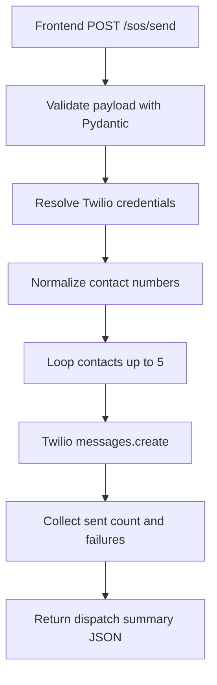

# VANI Backend README (Viva Preparation)

This README explains the backend in depth for viva questions:
- what is implemented
- why each part is needed
- how each part works in code

It is based on the current backend file:
- `isl_backend/app.py`

---

## 1. Backend Purpose

The backend has two major responsibilities:

1. Real-time ISL inference over WebSocket
- Receives camera frames from Flutter.
- Runs YOLO model inference on CPU.
- Returns label + confidence in near real time.

2. Emergency SOS SMS dispatch over HTTP
- Receives SOS payload from frontend.
- Uses Twilio API to send SMS to configured contacts.
- Returns delivery summary.

---

## 2. Technology Stack and Why Used

- FastAPI
  - Why: clean async APIs for both WebSocket and REST.
  - Used for `/ws`, `/health`, and `/sos/send`.

- Uvicorn
  - Why: production-ready ASGI server for FastAPI.
  - Used to run app in local and Railway.

- Ultralytics YOLO
  - Why: practical real-time sign detection model API.
  - Used for inference in `/ws`.

- OpenCV + NumPy
  - Why: decode image bytes into model-ready frames.

- gdown + urllib fallback
  - Why: robust model file download from Google Drive.

- Twilio Python SDK
  - Why: reliable SMS dispatch for emergency alerts.

- Pydantic models
  - Why: strict request validation for `/sos/send` payload.

---

## 3. Backend Architecture Overview

Key idea:
- Inference is streaming and stateful per socket.
- SOS is request/response and transactional.

---

## 4. Runtime Startup Flow

### Why this flow matters
- Model is loaded once globally for lower per-request overhead.
- If model is invalid, startup still succeeds but inference endpoint returns model-unavailable errors safely.

---

## 5. Environment Variables

### CORS
- `VANI_CORS_ORIGINS`
- `VANI_CORS_ORIGIN_REGEX`

### Twilio (preferred on deployment)
- `TWILIO_ACCOUNT_SID`
- `TWILIO_AUTH_TOKEN`
- `TWILIO_FROM_NUMBER`

### Port
- `PORT` (set by Railway)

### Twilio fallback from request headers
If server env variables are empty, `/sos/send` can use:
- `x-twilio-account-sid`
- `x-twilio-auth-token`
- `x-twilio-from-number`

This fallback is useful when credentials are provided by app build-time config.

---

## 6. Inference Pipeline (`/ws`)

### Input
- Base64 encoded frame text (with or without data URI prefix)
- control messages: `__PING__`, `__STOP__`

### Output
- prediction JSON packets
- keepalive `ping/pong`
- explicit error if model unavailable

### Inference flow

### Why `FRAME_SKIP_MS` is used
- Prevents overloading CPU with too many frames.
- Keeps event loop responsive for network traffic.

### Why `run_in_executor` is used
- YOLO predict is CPU-heavy.
- Running predict in thread executor avoids blocking async WebSocket loop.

---

## 7. Prediction Smoothing Logic

`PredictionSmoother` uses a deque window.

- push current `(label, confidence)`
- compute dominant label by frequency
- compute average confidence for dominant label only
- return stable output

Why needed:
- Raw frame predictions can jitter.
- Smoothed output is better for sentence building on frontend.

---

## 8. Health Endpoint (`GET /health`)

Returns:
- service status
- model loaded boolean
- inference engine identifier

Used for:
- deployment probes
- frontend diagnostics
- quick monitoring checks

---

## 9. SOS Endpoint (`POST /sos/send`)

Purpose:
- send emergency SMS to up to 5 contacts through Twilio.

### Request Model
- `type`: SOS type name
- `message`: final prepared emergency message
- `contacts`: array of `{name, phone}`
- `location`: optional object with lat/lng/display/maps link
- `platform`, `sent_at`: optional metadata

### Response Model
- `success`
- `sent_count`
- `total_contacts`
- `errors`
- `message`

### SOS dispatch flow

### Why phone normalization exists
- Contacts can be saved in different formats.
- Backend standardizes to E.164-compatible format before Twilio send.

---

## 10. Reliability and Safety Practices Already Implemented

- Corrupt model file detection by minimum file size.
- Download fallback path for model retrieval.
- Graceful inference behavior when model unavailable.
- WebSocket timeout keepalive handling.
- Defensive try/except per frame.
- Contact list capped at 5 for SOS dispatch.
- Per-contact error collection in Twilio dispatch.

---

## 11. File-by-File Backend Explanation

### `isl_backend/app.py`
Contains:
- app setup
- CORS
- model initialization
- prediction smoother
- `/ws`, `/health`, `/sos/send`

### `isl_backend/requirements.txt`
Dependency lock for:
- inference stack
- web server stack
- Twilio SDK

### `isl_backend/Dockerfile`
Containerized deployment with system libs required by OpenCV.

### `isl_backend/railway.json`
Railway deployment strategy and restart policy.

---

## 12. Important Viva Questions and Direct Answers

### Q1. Why WebSocket for inference instead of plain HTTP?
Because camera inference is continuous streaming. WebSocket avoids repeated HTTP handshake overhead and supports low-latency bidirectional communication.

### Q2. Why CPU model deployment?
To maximize compatibility and simplify deployment where GPU may not be available.

### Q3. How do you handle unstable predictions?
A moving-window smoother chooses dominant labels and averages confidence values.

### Q4. How is SOS made automatic?
Frontend builds final message with live location and calls backend `/sos/send`; backend loops over contacts and sends SMS via Twilio API.

### Q5. What happens if some SMS sends fail?
Response includes partial success with error list; successful sends are still counted.

---

## 13. End-to-End Backend Summary (Exam Ready)

The backend is a dual-channel FastAPI service. One channel is a WebSocket inference pipeline where frames are decoded, inferred using YOLO on CPU, smoothed, and streamed back as structured prediction events. The second channel is an HTTP emergency pipeline that validates SOS payloads and dispatches SMS through Twilio to up to five contacts. The service is deployment-ready with CORS control, model auto-download, keepalive handling, and explicit health checks.
