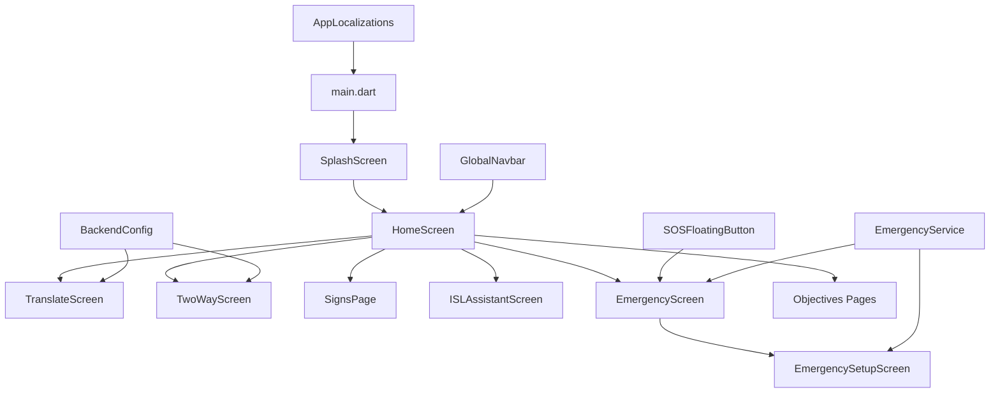
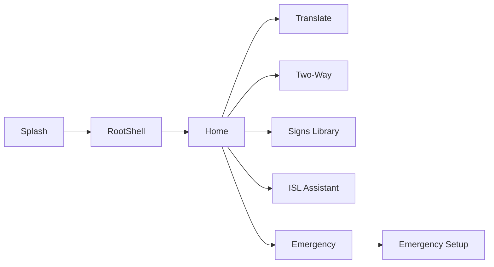
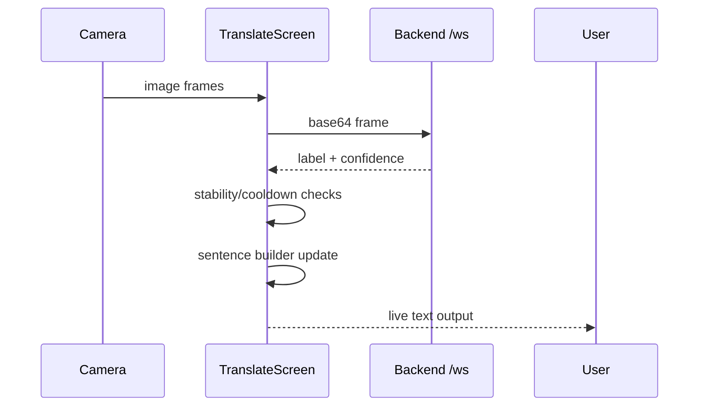
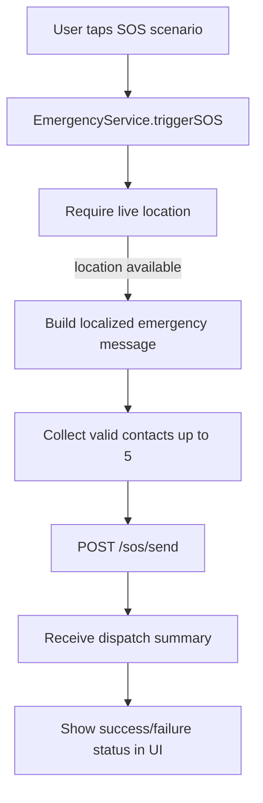

# VANI Frontend README (Viva Preparation)

This document explains the frontend in detail for viva:
- what each module does
- why it exists
- how it is implemented and connected

Primary frontend root:
- `lib/main.dart`

---

## 1. Frontend Purpose

Frontend responsibilities:
1. Capture and stream visual sign input.
2. Display real-time translated output.
3. Enable two-way deaf-hearing conversation.
4. Provide emergency SOS UI and contact management.
5. Provide multilingual and accessible UX.

---

## 2. Frontend Tech Stack and Why Used

- Flutter
  - Why: one codebase for web, Android, iOS, desktop.

- Camera package
  - Why: direct access to live camera frames for sign detection.

- WebSocket client
  - Why: low-latency bidirectional channel for continuous inference.

- Hive
  - Why: lightweight local persistence for emergency contacts.

- Geolocator
  - Why: acquire live location for SOS payloads.

- Flutter TTS + Speech-to-Text
  - Why: accessibility for hearing and speech interaction flows.

- HTTP client
  - Why: API calls (Gemini assistant and SOS backend dispatch).

---

## 3. High-Level Frontend Architecture

---

## 4. App Boot Flow

### File: `lib/main.dart`

Boot sequence:
1. Flutter binding initialization.
2. App bootstrap (Hive setup + contact adapter + contact box).
3. Run app with theme + localization + root route.

Why this order:
- Storage and service prerequisites are initialized before interactive screens.

---

## 5. Runtime Navigation Flow

Implementation pattern:
- Home acts as navigation hub.
- Web and mobile layouts are rendered differently from the same screen classes.

---

## 6. Shared Core Layers

## 6.1 Localization Layer

### File: `lib/l10n/AppLocalizations.dart`

What:
- central string table for supported locales.
- `t(key)` lookup model used across screens.

Why:
- avoids hardcoded strings in UI.
- keeps multilingual behavior consistent.

How:
- widget code calls `AppLocalizations.of(context).t('key')`.

---

## 6.2 Backend Routing Layer

### File: `lib/services/backend_config.dart`

What:
- resolves websocket and API base URLs.
- supports `--dart-define` envs for local/prod builds.

Why:
- no hardcoded endpoint duplication in screens.
- supports emulator/loopback differences.

How:
- candidate URL generation + platform-aware fallback.

---

## 6.3 Emergency Domain Layer

### File: `lib/services/EmergencyService.dart`

What:
- single service for SOS lifecycle.
- manages Hive contacts.
- obtains mandatory live location.
- dispatches SOS via backend Twilio endpoint.

Why:
- centralizes critical emergency logic.
- keeps UI screens simple and consistent.

How:
- `triggerSOS(...)` orchestrates flow:
  - validate contacts
  - enforce location
  - build localized message template
  - call backend `/sos/send`
  - return `SOSResult`

---

## 7. Data Model

### File: `lib/models/EmergencyContact.dart`

Fields used by SOS:
- name
- phone
- relation
- isPrimary
- supabaseId (legacy persisted field)

Why model exists:
- typed contact representation for Hive + UI.

### File: `lib/models/EmergencyContact.g.dart`

- generated Hive adapter for binary read/write.

---

## 8. Feature Screen Deep Dive

## 8.1 Translate Screen

### File: `lib/screens/TranslateScreen.dart`

What:
- real-time sign-to-text translation terminal.

Why:
- core accessibility feature for direct sign understanding.

How:
1. initialize camera
2. capture frames periodically
3. send frames on WebSocket
4. receive predictions
5. run token acceptance logic
6. construct sentence via rules
7. show transcript and confidence status

Flow:

---

## 8.2 Two-Way Screen

### File: `lib/screens/TwoWayScreen.dart`

What:
- bidirectional conversation channel for deaf and hearing users.

Why:
- accessibility must support both directions, not only sign decoding.

How:
- Deaf side: signs -> backend prediction -> message thread.
- Hearing side: typed/speech input -> text + optional TTS playback.
- Shared chat thread keeps conversation context.

---

## 8.3 Signs Library Screen

### File: `lib/screens/Signspage.dart`

What:
- educational catalog of signs with categories and search.

Why:
- supports learning and familiarization with sign vocabulary.

How:
- local sign dataset rendered in responsive list/grid.
- category filters + search pipeline on in-memory entries.

---

## 8.4 ISL Assistant Screen

### File: `lib/screens/Islassistantscreen.dart`

What:
- AI assistant for ISL guidance, explanations, and phrase support.

Why:
- complements detection features with interactive learning support.

How:
- builds prompt context
- sends request to model endpoint
- renders multi-language conversational response
- supports voice input and output

---

## 8.5 Emergency Screen

### File: `lib/screens/EmergencyScreen.dart`

What:
- scenario-driven SOS trigger panel.

Why:
- quick emergency actions are needed under stress.

How:
- predefined scenarios map to message templates.
- one tap calls `EmergencyService.triggerSOS`.
- status banners show dispatch result.

---

## 8.6 Emergency Setup Screen

### File: `lib/screens/EmergencySetupScreen.dart`

What:
- CRUD for up to 5 emergency contacts.

Why:
- SOS delivery depends on preconfigured trusted contacts.

How:
- add/edit/delete contact forms
- validation for phone and required fields
- set primary contact
- Hive-backed persistence

---

## 9. SOS End-to-End Frontend Flow

Why this is correct for emergency UX:
- fully automatic dispatch path
- no manual copy/send dependency during distress

---

## 10. Web vs Mobile Implementation Notes

Mobile:
- compact layouts
- camera-intensive flows
- floating SOS button integration
- optional shake trigger path in service

Web:
- larger split sections and long-scroll home sections
- same services, different layout composition

Both share:
- same localization keys
- same emergency service contracts
- same backend routing strategy

---

## 11. Objective Pages Architecture

Directory:
- `lib/screens/objectives/`

Pattern:
- `objective_shared.dart` provides reusable structural widgets.
- each objective page supplies localized content and accent.

Why:
- avoids UI duplication
- keeps educational sections consistent in style and behavior

---

## 12. Frontend Reliability Decisions

- Service-layer orchestration for critical flows (SOS).
- Explicit result objects (`SOSResult`) for predictable UI handling.
- URL candidate fallback for backend connectivity.
- Localization-first UI rendering.
- Responsive layouts for web and mobile breakpoints.

---

## 13. Viva Summary (Frontend)

The frontend is a modular Flutter architecture where the Home screen routes into specialized feature screens for translation, two-way communication, learning, assistant guidance, and emergency operations. Shared services handle backend connectivity, localization, and emergency orchestration. Emergency flow is implemented as an automatic backend dispatch pipeline with mandatory live location, while translation flow runs as a low-latency WebSocket stream with frontend temporal stabilization and sentence construction.
