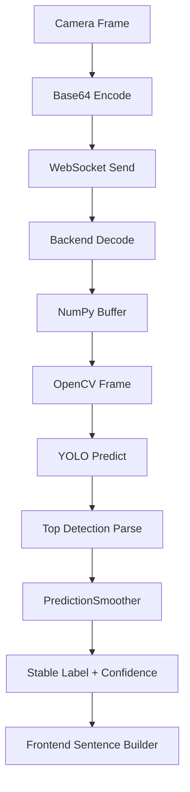
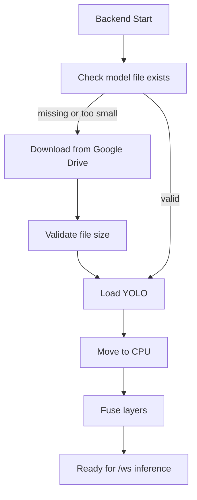
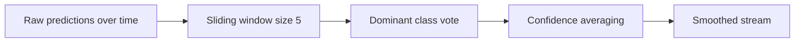

# VANI ML README (Viva Preparation)

This document explains the ML layer in practical viva style:
- what the ML component does
- why each decision exists
- how inference is implemented end to end

Primary implementation reference:
- `isl_backend/app.py`

---

## 1. ML Objective in This Project

VANI performs real-time ISL sign recognition from camera frames.

Input:
- image frames from frontend camera stream

ML task:
- single dominant sign detection/classification per frame

Output:
- predicted sign label
- confidence score

Integration path:
- Flutter camera -> WebSocket -> FastAPI -> YOLO inference -> smoothed prediction -> Flutter UI

---

## 2. Model and Runtime Setup

Model details from code:
- Framework: Ultralytics YOLO
- Weights file: `model/isl_best.pt`
- Runtime device: CPU (`to("cpu")`)
- Model optimization: `fuse()`

Inference parameters:
- `CONF_THRESHOLD = 0.30`
- `MAX_DET = 1`
- `FRAME_SKIP_MS = 80`

Why these values:
- `conf=0.30`: balances recall and false positives
- `max_det=1`: app expects one primary sign at a time
- `frame_skip=80ms`: reduces CPU load while keeping interactive speed

---

## 3. ML Pipeline Overview



---

## 4. Startup ML Flow



Key reliability rule:
- Small/corrupt model file is deleted and re-downloaded.

Why this is important:
- Cloud deployments can start with partial files.
- Startup auto-recovery prevents silent bad inference.

---

## 5. Frame-Level Inference Steps

For every frame payload at `/ws`:

1. Receive text payload.
2. Handle protocol control messages (`__PING__`, `__STOP__`).
3. Apply frame-throttle guard with `FRAME_SKIP_MS`.
4. Decode Base64 bytes.
5. Convert bytes to OpenCV image.
6. Run YOLO predict in executor thread.
7. If box exists: parse class id + confidence.
8. If no box: emit `No Sign`, confidence `0.0`.
9. Pass output through smoother.
10. Return prediction packet to frontend.

---

## 6. Why Executor Inference Is Used

Model inference is CPU-bound.

If inference runs directly on async event loop:
- socket responsiveness degrades
- keepalive and control messages lag

So inference runs in `run_in_executor` to keep async loop responsive.

---

## 7. Prediction Smoothing: Exact Logic

`PredictionSmoother(window=5)` maintains recent `(label, confidence)` entries.

Algorithm:
- append current prediction
- dominant label = highest frequency in window
- confidence = average confidence of dominant-label entries
- emit dominant label and averaged confidence



Why used:
- reduces jitter from frame-to-frame noise
- improves downstream language construction

---

## 8. Message Protocol Between Frontend and ML Backend

### Incoming types
1. Base64 frame string
2. `__PING__`
3. `__STOP__`

### Outgoing types
1. Prediction packet
```json
{
  "type": "prediction",
  "label": "hello",
  "confidence": 0.91,
  "frame": 84
}
```

2. Keepalive
```json
{"type": "ping"}
{"type": "pong"}
```

3. Error packet
```json
{"type": "error", "message": "Model not available on server"}
```

---

## 9. ML to NLP Bridge on Frontend

Backend outputs sign labels, not full sentences.

Frontend logic then does:
- temporal token acceptance (stability and cooldown)
- phrase/sentence assembly from predefined grammar maps

So final language quality depends on:
- backend prediction stability
- frontend token policy

This separation keeps backend lightweight and inference-focused.

---

## 10. Performance Reasoning for Viva

### Throughput
- Frame skipping constrains inference frequency.
- CPU stays stable for real-time interaction.

### Latency
- Lower than request/response HTTP loops due to persistent WebSocket.

### Accuracy stability
- Smoothed confidence and dominant voting reduce false spikes.

### Trade-off
- Slight delay for smoother output is accepted for better usability.

---

## 11. Error Handling in ML Path

Implemented protections:
- invalid frame decode is skipped, not fatal
- per-frame try/except in socket loop
- model unavailable detected early and reported
- timeout keepalive prevents dead socket sessions

Result:
- one bad frame does not crash stream
- backend remains available during noisy input

---

## 12. Core ML Concepts You Can Explain in Viva

### Precision and Recall
- Precision: quality of predicted positives
- Recall: coverage of true positives

Formulas:
- $Precision = \frac{TP}{TP + FP}$
- $Recall = \frac{TP}{TP + FN}$

### Confidence thresholding
- Controls minimum acceptable prediction confidence.

### Temporal smoothing
- Uses short history to stabilize predictions over time.

### Real-time systems design
- Balances accuracy, latency, and compute budget.

---

## 13. Deployment Notes for ML Layer

- CPU wheels for torch are installed via extra index URL.
- Model file auto-fetch supports reproducible deploys.
- `/health` endpoint exposes model readiness.

Why this matters:
- Inference service can be monitored and restarted safely in production.

---

## 14. Viva Summary Paragraph

VANI uses a YOLO-based vision model to recognize ISL signs from streaming camera frames. The backend decodes Base64 images, runs CPU inference, applies temporal smoothing, and returns stable label-confidence events over WebSocket. Runtime safeguards include model file validation, auto-download recovery, keepalive signaling, and frame-level exception isolation. This design provides practical real-time recognition while preserving service stability under deployment constraints.
